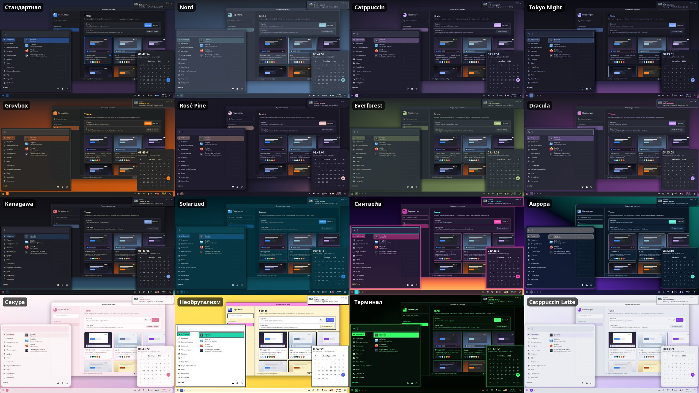

# syndesktop

Окружение рабочего стола для Wayland на Rust. Интерфейс написан на [syngui](../syngui).
Устроено как Plasma: отдельно композитор, оболочка и «Параметры системы».
Почти всё настраивается через `~/.config/syndesktop/config.toml`, изменения применяются на лету.

| Бинарь | Что делает |
|---|---|
| `syndesktop` | Композитор на smithay 0.7: DRM/KMS (несколько GPU, горячее подключение, DPMS) или вложенное окно. Серверные рамки, столы, раскладки floating/tile/columns/grid/monocle, прилипание к половинам экрана, обзор окон, Alt+Tab, правила окон, Xwayland, IPC. |
| `syndesktop-shell` | Оболочка на syngui (layer-shell): обои, панели с апплетами, док, меню запуска, уведомления (D-Bus), OSD, меню питания, переключатель окон, экран блокировки (ext-session-lock + PAM). |
| `syndesktop-settings` | «Параметры системы»: 18 страниц. Правит `config.toml` через toml_edit, комментарии сохраняются. |
| `syndesktop-files` | Проводник в духе Windows 11: вкладки в заголовке, две панели, виды «значки / плитка / список / таблица», миниатюры, рамка выделения, перетаскивание, операции в фоне с паузой и отменой, Ctrl+Z, корзина, поиск; встроенный просмотрщик картинок (масштаб, поворот по EXIF, HEIC, лента папки). [docs/FILES.md](docs/FILES.md) |

Темы оформления — 14 встроенных (Nord, Catppuccin, Tokyo Night, Gruvbox, Rosé Pine, Everforest,
Dracula, Kanagawa, Solarized, Синтвейв, Аврора, Сакура, Необрутализм, Терминал) и свои на MSS:
[docs/THEMES.md](docs/THEMES.md).



**Док** в духе macOS / Latte Dock: значок под курсором вырастает над полосой, индикаторы окон,
прыжки и частицы при запуске, 3D-наклон и вращение значков, 3D-полка с отражениями, разделы
(группы значков во всплывающем окне — сетка, список или веер) и папки, автоскрытие и умное
скрытие. Значки, разделы и папки есть и на обычных панелях; всё добавляется и переставляется
мышью в режиме редактирования (правый клик по панели → «Изменить»). Подробно — [docs/DOCK.md](docs/DOCK.md).

**Адаптивная панель** (`defloat`): плавающая панель прижимается к краю во всю длину, когда окно
развёрнуто или касается её, как в Plasma 6. **Панель как заголовок окна**: апплеты «Заголовок
окна», «Кнопки окна» и «Глобальное меню» (строка меню Qt/KDE- и GTK-программ, например GIMP, как в macOS) вместе с
`borderless_maximized` превращают верхнюю панель в заголовок развёрнутого окна — «Параметры
системы» → «Панели» → «Добавить панель-заголовок».

Архитектура, IPC и контракт команд оболочки описаны в [docs/ARCHITECTURE.md](docs/ARCHITECTURE.md).
Полный пример конфига с комментариями: [crates/syndesktop-common/default-config.toml](crates/syndesktop-common/default-config.toml).

## Сборка и запуск

```sh
cargo build --profile fast-release        # быстро, для работы (target/fast-release)
cargo build --release                     # LTO, для публикации
# вложенно в текущем сеансе (окно):
target/fast-release/syndesktop --nested
# настоящий сеанс: makepkg -si (или SYNDESKTOP_PROFILE=fast-release makepkg -si),
# затем выбрать «syndesktop» в менеджере входа
```

## Управление

```sh
syndesktop msg windows | workspaces | outputs | layouts | events
syndesktop msg action "workspace 2"
syndesktop msg action "spawn firefox"
syndesktop msg window 5 minimize
syndesktop msg action "shell edit-dock"   # режим редактирования дока (edit-panel N — панели)
syndesktop msg restart-shell   # перезапустить панели и меню, окна остаются
syndesktop msg restart         # перезапустить композитор (окна программ закроются)
```

Основные сочетания клавиш (любое можно переопределить в `[keybindings]`):

| Клавиши | Действие |
|---|---|
| Super+Return | терминал |
| Super+D / Alt+F1 | меню запуска |
| Alt+Space | строка запуска |
| Super+1…9 / Super+Shift+1…9 | перейти на стол / перенести окно на стол |
| Super+←/→/↑/↓ | прилепить окно к краю, развернуть, свернуть |
| Super+T | сменить раскладку |
| Super+Tab | обзор окон |
| Alt+Tab | переключение окон |
| Super+ЛКМ / Super+ПКМ | переместить / изменить размер окна |
| Print | снимок экрана |
| Super+Escape | заблокировать экран |
| Super+Shift+E | меню питания |

Логи пишутся в `~/.local/state/syndesktop/` (`syndesktop.log`, `shell.log`).
