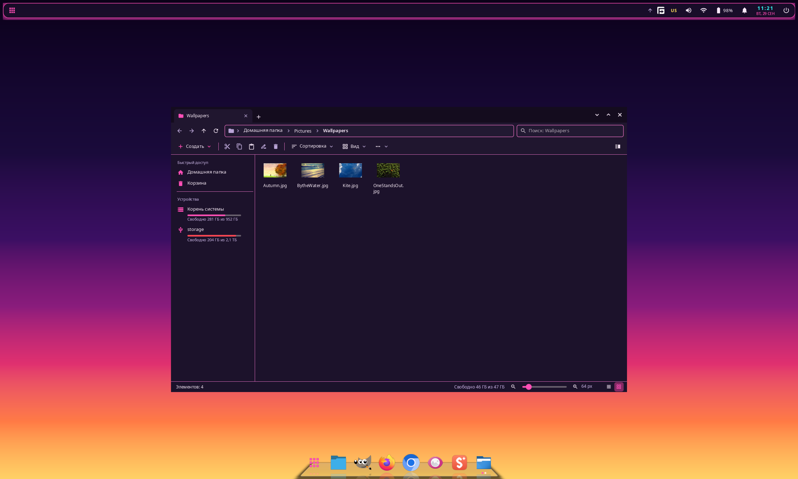
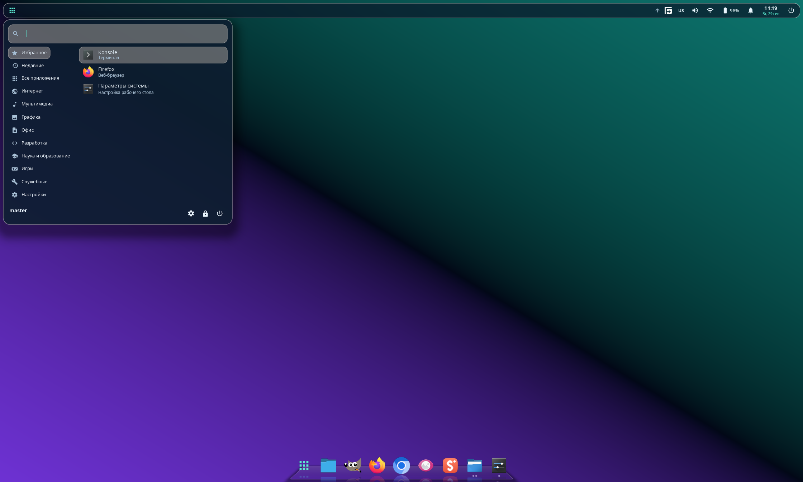
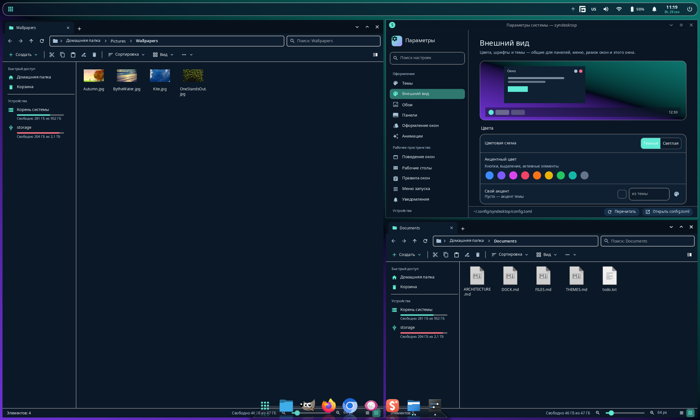
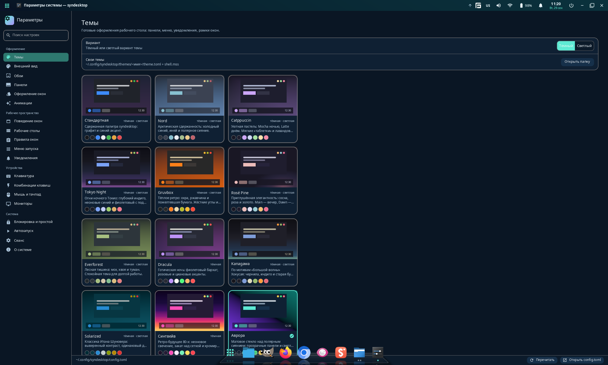
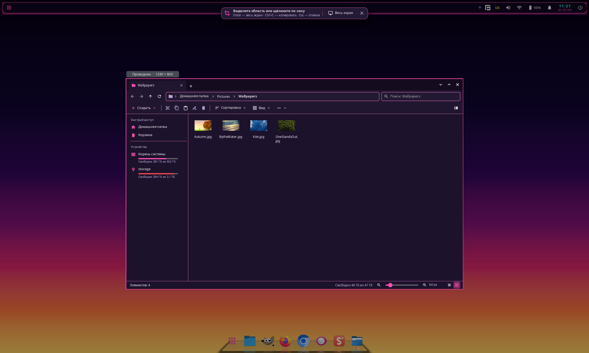

# synshell

[](#licence)
[-informational)](#build-and-run)
[](#how-it-is-built)

A Wayland desktop environment written in Rust. It is split the way KDE Plasma is: a compositor
(the KWin role), a separate shell process for panels, dock, launcher and notifications (the
plasmashell role) and a System Settings app — plus a file manager and a screenshot tool. All of
the UI is built with my own GUI framework, [syngui](https://github.com/VitaminDB/syngui); the
compositor is built on [smithay](https://github.com/Smithay/smithay).

Almost everything is configured in one file, `~/.config/synshell/config.toml`. The compositor
and the shell watch it and apply changes live; System Settings edits the same file in place and
keeps your comments.



## Status

Early. One developer, one machine. The first commit is from September 2026, and the pace since
then has been fast, so expect rough edges and config keys that still move. It runs as my login
session on Arch Linux on a hybrid laptop (Intel Arrow Lake iGPU driving the internal 2560×1600
240 Hz panel at 1.4× scale, plus an NVIDIA RTX 5090 Laptop GPU). Multiple GPUs, monitor hotplug and
other distributions are handled in the code, but no configuration other than this one has been
tested.

**The interface is in Russian only for now**, and so is the documentation in `docs/`.

## What is in the box

| Binary | What it does |
|---|---|
| `synwm` | Compositor on smithay 0.7: DRM/KMS (multiple GPUs, hotplug, DPMS) or a nested window for development. Server-side decorations, workspaces, floating / tile / columns / grid / monocle layouts, snapping to edges and halves, window overview, Alt+Tab, window rules, Xwayland, a JSON IPC socket and the `synwm msg` CLI. |
| `syndesktop-shell` | The shell (layer-shell surfaces): wallpaper, panels with applets, dock, launcher, notification server (D-Bus), OSD, power menu, window switcher, system tray (StatusNotifierItem), lock screen (ext-session-lock + PAM). If it crashes, the compositor restarts it and your windows stay. |
| `synmobile-shell` | The phone shell (status bar, navigation bar, home screen). The compositor picks it automatically on a phone form factor; see `docs/MOBILE.md`. |
| `synsettings` | System Settings: 18 pages. Edits `config.toml` through `toml_edit`, so comments and ordering survive. |
| `synfiles` | A file manager modelled on Windows 11 Explorer: tabs in the title bar, dual pane, icons / tiles / list / details views, thumbnails, rubber-band selection, drag and drop, background operations with pause and cancel, Ctrl+Z, freedesktop trash, search. `--viewer` is a built-in image viewer (zoom, EXIF rotation, HEIC, folder filmstrip). |
| `synshot` | Region / window / monitor screenshot on Print: the screen freezes, you drag a frame (handles, magnifier, arrow-key nudging) or click a window; copy, save, copy path or open. |

## Features

- **Dock** (`mode = "dock"` on any panel), in the spirit of the macOS dock and Latte Dock: the
  icon under the cursor grows above the bar, window indicators, launch bounce and particles,
  3D tilt and spin on hover, a 3D shelf with reflections, groups (a popup with a grid, list or
  fan of icons), folders, autohide and intellihide. Everything is added and rearranged with the
  mouse in edit mode (right-click the panel → Edit). See [docs/DOCK.md](docs/DOCK.md).
- **Adaptive panel** (`defloat`): a floating panel snaps to the screen edge at full length when a
  window is maximized or touches it, as in Plasma 6.
- **Panel as a title bar**: the window-title, window-buttons and global-menu applets, together
  with `borderless_maximized`, turn the top panel into the title bar of the maximized window.
  The global menu reads Qt/KDE menus (`org_kde_kwin_appmenu`, dbusmenu) and GTK 3 menus
  (`gtk_shell1`, `org.gtk.Menus`) — GIMP 3 included.
- **Themes**: 14 built-in (Nord, Catppuccin, Tokyo Night, Gruvbox, Rosé Pine, Everforest, Dracula,
  Kanagawa, Solarized, Synthwave, Aurora, Sakura, Neobrutalism, Terminal), each with dark and/or
  light variants, a wallpaper and its own stylesheet; your own themes are a `theme.toml` plus
  MSS. Switching themes cross-fades colours without rebuilding surfaces. The palette is also
  exported to GTK 3/4, Qt/KDE (`kdeglobals`) and GIMP so that applications match. See
  [docs/THEMES.md](docs/THEMES.md).
- **Shell animations**: popups flow out of the panel they belong to, notifications slide and
  re-stack, the launcher morphs between sections — all drawn by the shell with syngui animation
  primitives.
- **Lock screen** built into the shell (ext-session-lock, password checked through PAM), idle
  handling, screen capture for portals (`wlr-screencopy`, works with xdg-desktop-portal-wlr for
  browsers and OBS).

| Launcher | Tile layout |
|---|---|
|  |  |

| System Settings — Themes, maximized under the panel-as-title-bar | Screenshot tool |
|---|---|
|  |  |

## Build and run

synshell path-depends on syngui, so check both repositories out next to each other:

```sh
git clone https://github.com/VitaminDB/syngui
git clone https://github.com/VitaminDB/synshell
cd synshell
cargo build --profile fast-release        # quick local build → target/fast-release
cargo build --release                     # LTO build → target/release
```

The workspace sets `rust-version = "1.85"`. Build and runtime dependencies (Arch package names):
mesa, libinput, seatd, systemd-libs, libxkbcommon, libdrm, vulkan-icd-loader, fontconfig,
freetype2, dbus. Optional ones — xorg-xwayland, wireplumber, brightnessctl, networkmanager,
playerctl, wl-clipboard, xdg-desktop-portal-wlr, ffmpegthumbnailer, libheif, imagemagick,
breeze-icons — are listed with their purpose in the [PKGBUILD](PKGBUILD).

**Nested, inside your current Wayland or X11 session** (it runs in a window):

```sh
PATH="$PWD/target/fast-release:$PATH" target/fast-release/synwm --nested
```

The compositor starts `syndesktop-shell` from `PATH`, hence the `PATH` prefix. A nested
instance reads the same `~/.config/synshell/config.toml` (written with defaults on first
start) and, with the defaults, starts `~/.config/autostart/*.desktop` and writes the theme
colours into your GTK and KDE colour files (`app_colors`). To try it without touching your own
setup, point it at a separate config directory (`app_colors` is skipped then) whose
`config.toml` turns autostart off — every field is optional:

```sh
mkdir -p /tmp/synshell-test
printf '[general]\nxdg_autostart = false\n' > /tmp/synshell-test/config.toml
SYNSHELL_CONFIG_DIR=/tmp/synshell-test PATH="$PWD/target/fast-release:$PATH" \
    target/fast-release/synwm --nested
```

**As a real session** on Arch Linux:

```sh
makepkg -si                                   # release build
SYNSHELL_PROFILE=fast-release makepkg -si   # faster local build
```

then pick “synshell” in your display manager. The package installs the binaries, the session
file, a PAM file for the lock screen, portal configuration and the `.desktop` files.

Logs go to `~/.local/state/synshell/` (`synwm.log`, `shell.log`).

## Controls

Main key bindings (any of them can be remapped in `[keybindings]`):

| Keys | Action |
|---|---|
| Super+Return | terminal |
| Super+D / Alt+F1 | launcher |
| Alt+Space | run prompt |
| Super+1…9 / Super+Shift+1…9 | go to workspace / move window to workspace |
| Super+←/→/↑/↓ | snap to an edge, maximize, minimize |
| Super+T | cycle layout |
| Super+Tab | window overview |
| Alt+Tab | window switcher |
| Super+LMB / Super+RMB | move / resize a window |
| Print | screenshot of a region or window |
| Shift+Print / Alt+Print | screenshot of the screen / window straight to a file |
| Super+Escape | lock the screen |
| Super+Shift+E | power menu |

Everything is also scriptable over IPC:

```sh
synwm msg windows | workspaces | outputs | layouts | events
synwm msg action "workspace 2"
synwm msg action "layout tile"
synwm msg action "spawn firefox"
synwm msg action "shell launcher"      # any shell command: launcher, edit-dock, lock, …
synwm msg window 5 minimize            # activate | close | maximize | floating | workspace N …
synwm msg restart-shell                # restart panels and menus, windows stay
synwm msg restart                      # restart the compositor (application windows close)
```

## Documentation

The documentation in [`docs/`](docs/) is **in Russian**:

- [ARCHITECTURE.md](docs/ARCHITECTURE.md) — processes, crates, config loading, IPC protocol,
  shell commands, layer-shell namespaces, animations.
- [DOCK.md](docs/DOCK.md) — dock and panel icons, groups, folders, edit mode.
- [THEMES.md](docs/THEMES.md) — theme format, MSS variables, writing your own theme.
- [FILES.md](docs/FILES.md) — the file manager and image viewer.

The fully commented default config is
[crates/synshell-common/default-config.toml](crates/synshell-common/default-config.toml).

## Related

- [syngui](https://github.com/VitaminDB/syngui) — the Rust GUI framework (wgpu, MSS stylesheets,
  reactive signals) that every window and panel here is drawn with.
- [synthos](https://github.com/VitaminDB/synthos) — a local AI desktop studio on the same
  framework; it picks up the synshell theme and window buttons when running in a synshell
  session.

## How it is built

This project is vibe-coded. Since spring 2026 I write all of my projects with [Claude Code](https://claude.com/claude-code): I decide what to build and how it fits together, describe each task, and review, run and test the result on my own machine — the model writes the code, the tests and most of the documentation. I use synshell as my own desktop session, so what is described here is what I run daily.

## Support

synshell is free and open source, written by one person. If it is useful to you, you can support its development with a donation via [PayPal](https://paypal.me/vitamindbnfkz).

## Licence

MIT OR Apache-2.0 — see [LICENSE-MIT](LICENSE-MIT) and [LICENSE-APACHE](LICENSE-APACHE).
